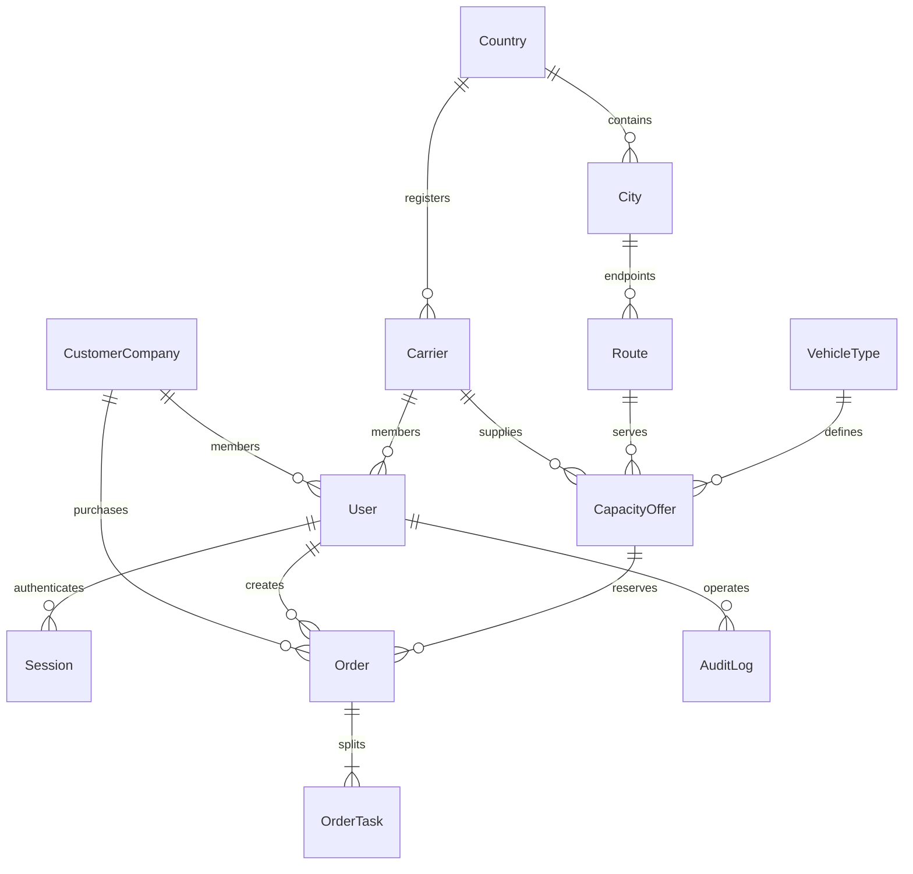

# M1 架构与数据库

## 现有项目与选型

原项目只有 Worker 占位响应、`/health`、GitHub Actions。M1 保留 Workers、GitHub Actions 和 D 盘工作目录，新增 React/TypeScript/Vite、Hono、Zod 和 D1。D1 的 `batch()` 是事务，任一句失败会回滚全部语句；库存通过数据库触发器实施条件校验和扣减，不能被不同请求的读取间隙绕过。官方说明：https://developers.cloudflare.com/d1/worker-api/d1-database/

不引入 Redis、Prisma 或独立 Node 服务，避免 M1 的额外运维；未来可将 SQL 仓储替换成 PostgreSQL，迁移时应重写触发器和事务实现，并保留相同并发测试。

## 分层

- `src/web/`：三端界面、网络适配器、响应式样式。REST API 与页面分离，未来小程序可复用契约。
- `src/api/`：路由、会话认证、RBAC、来源校验、参数与错误处理。
- `src/services/`：运力/订单业务、状态入口、价格计算、审计、密码和限速。
- `migrations/`：外键、唯一约束、check 约束、索引、原子库存触发器及基础字典。
- `tests/`：真实 D1 集成测试及浏览器闭环测试。

## ERD

`users` 用 role 与互斥的企业/车队外键统一表示 CustomerUser、CarrierUser 和平台员工，避免三套密码与会话实现。M1 每个用户只有一个角色、至多一个租户。`auth_limits` 是限速辅助表。

## 表与约束

13 张表：countries、cities、customer_companies、carriers、users、sessions、auth_limits、vehicle_types、routes、capacity_offers、orders、order_tasks、audit_logs（国家、城市作为字典）。所有可变业务主表均有 created_at/updated_at。字典不提供删除 API；线路/车型使用状态停用，订单与审计不提供删除 API。

国家/城市组合外键保证城市归属；路线起终点不能相同。业务主对象 UUID；订单/运力有带日期的可读编号；任务编号为订单编号追加序号。价格整数分，比例 0–10000 bps；数据库约束保证单价、总额、四舍五入首款与尾款的算术一致。

## 下单事务

1. 会话校验客户角色，读取服务端企业 ID；解析严格 Zod schema，拒绝注入价格或状态字段。
2. 按 `(customer_user_id, idempotency_key)` 查重，对规范请求计算 SHA-256；同键不同载荷返回 409。
3. 读取可售运力与当前线路/车型，检查单车重量、尺寸，计算整数金额及快照。
4. D1 batch 插入 Order、N 个 OrderTask 和 AuditLog。
5. Order 的 BEFORE INSERT trigger 在事务内重新检查运力库存、有效期、线路/车型/车队状态、客户归属、金额快照和货物限制，然后扣减库存；最后一台售出设置 SOLD_OUT。
6. 任一任务、审计或约束失败，订单与库存一起回滚。并发重试冲突后重新读取幂等记录，不重复扣库存。

数据库禁止后续修改订单价格与归属快照。M1 唯一订单初始状态由服务函数产生 `PAYMENT_PENDING`；不接受任意状态更新请求。审核采用带旧状态条件的更新，只有一个审核请求成功，审计与更新同事务。

触发器内的 CASE 表达式显式加括号，以兼容 D1 远端 SQL 分句器；已在远端实际执行迁移验证。相关上游问题：https://github.com/cloudflare/workers-sdk/issues/4727 。

## 权限

| 角色        | 范围                                                        |
| ----------- | ----------------------------------------------------------- |
| CUSTOMER    | 自己企业、匿名市场、自己企业订单                            |
| CARRIER     | 自己车队档案、发布和查看自己运力                            |
| SUPER_ADMIN | 所有 M1 管理功能、平台成员、审计                            |
| OPERATIONS  | 订单/客户/车队/运力查看、线路和车型维护，不审核、不确认付款 |
| REVIEWER    | 查看并审核车队/运力，不能查看订单成本详情                   |
| FINANCE     | 订单与基础数据只读，M1 没有付款确认端点                     |

客户序列化白名单隐藏车队 ID、车队成本与平台服务费。CSRF 由 SameSite、Origin 和自定义请求头共同防护；无跨域 CORS 开放。所有 SQL 参数使用绑定，不拼接用户值。

## 已明确的 M1 决策

- 第 61 节优先：创建 OrderTask，但第 53 节的任务履约仍留在 M2。
- 元/百分比在页面输入，API 使用整数分/bps。
- 装货日按 UTC 日进行过期判断；界面明确时间字段，后续多线路可增加业务时区。
- 货物数量、重量和尺寸按每台车申报，订单中的车辆采用相同货物配置。
- 有效期过后立即从客户市场隐藏，即使数据库的 AVAILABLE 状态尚未改为 EXPIRED。
- 审核通过直接进入 AVAILABLE，不额外停留在 APPROVED。
- 不提前实现 M2–M5；不允许通过改状态绕过后续付款与履约。
